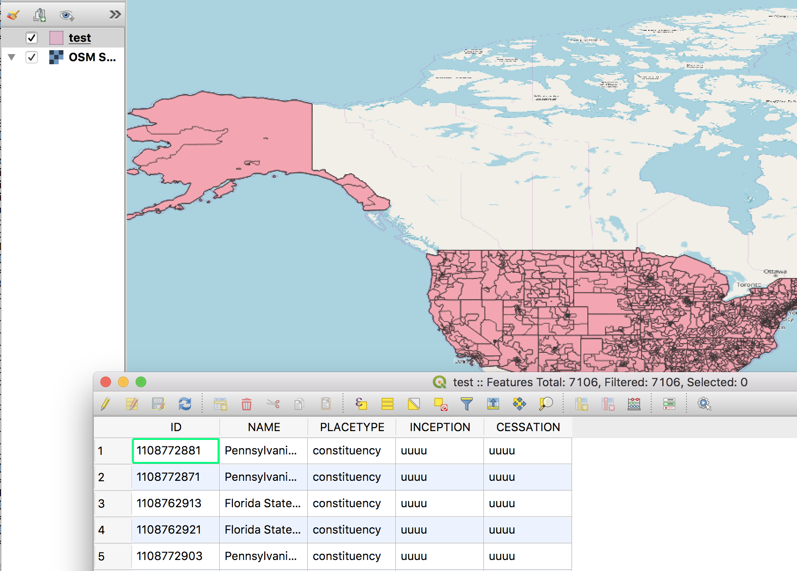

# go-whosonfirst-shapefile

Go package for working with Who's On First documents and ESRI shapefiles.

## Install

You will need to have both `Go` (specifically a version of Go more recent than 1.6 so let's just assume you need [Go 1.8](https://golang.org/dl/) or higher) and the `make` programs installed on your computer. Assuming you do just type:

```
make bin
```

All of this package's dependencies are bundled with the code in the `vendor` directory.

## Important

This works. Until it doesn't. Currently it only write points and polygons.

There is a lot still to do including moving code in to generic package (library) functions and sorting out common attributes.

## Tools

### wof-shapefile-index

```
./bin/wof-shapefile-index -h
Usage of ./bin/wof-shapefile-index:
  -belongs-to value
    	Include only records that belong to this ID. You may pass multiple -belongs-to flags.
  -exclude-placetype value
    	Exclude records of this placetype. You may pass multiple -exclude-placetype flags.
  -include-placetype value
    	Include only records of this placetype. You may pass multiple -include-placetype flags.
  -mode string
    	The mode to use importing data. Valid modes are: directory,feature,feature-collection,files,geojson-ls,meta,path,repo,sqlite. (default "repo")
  -out string
    	Where to write the new shapefile
  -shapetype string
    	The shapefile type to use indexing data. Valid types are: POINT,POLYGON. (default "POINT")
  -timings
    	Display timings during and after indexing
```

For example:

```
$> ./bin/wof-shapefile-index -shapetype POLYGON -out test.shp -mode repo /usr/local/data/whosonfirst-data-constituency-us/
...time passes

$> du -h test.*
3.0M	test.dbf
401M	test.shp
 56K	test.shx
```

See the way there is no `test.prj` file? That is a known-known: For whatever reason the [go-shp](https://github.com/jonas-p/go-shp) package doesn't produce it and I haven't accounted for that yet. If you're wondering the projection is:

```
GEOGCS["GCS_WGS_1984",DATUM["D_WGS_1984",SPHEROID["WGS_1984",6378137,298.257223563]],PRIMEM["Greenwich",0],UNIT["Degree",0.017453292519943295]]
```

All of which ends up looking something like this:



## See also:

* https://github.com/jonas-p/go-shp
* https://www.esri.com/library/whitepapers/pdfs/shapefile.pdf